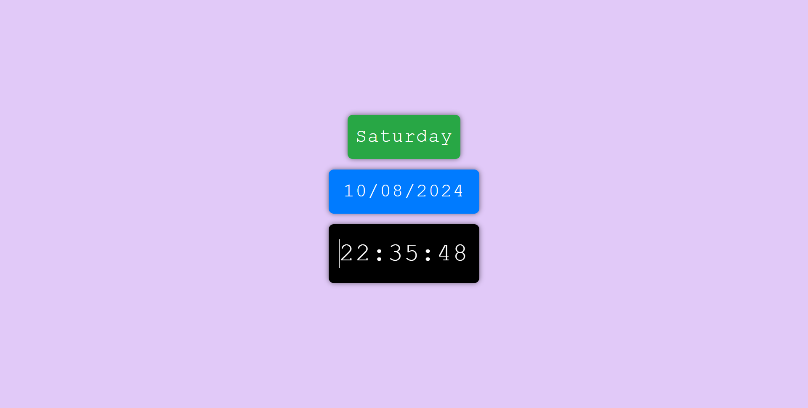

# Digital Clock & Date Display

  
  


A simple, elegant web application that displays the current time, date, and day of the week in a digital format. This project leverages React, Bootstrap, and custom CSS to create a modern and responsive user interface.

## 🌟 Features

- **Real-Time Clock**: Displays the current time, updated every second.
- **Date Display**: Shows the current date in a digital format.
- **Day of the Week**: Displays the current day of the week.
- **Responsive Design**: The layout adapts seamlessly to different screen sizes.
- **Custom Styling**: Utilizes Bootstrap and custom CSS for an appealing UI/UX.

## 📸 Screenshots



## 🚀 Live Demo

Check out the live demo of this project [here](https://uptodatewatch.netlify.app).

## 🛠️ Installation

To run this project locally, follow these steps:

1. **Clone the repository**:

   ```bash
   git clone https://github.com/your_username/your_repository_name.git
   cd your_repository_name
   ```

2. **Install dependencies**:

   ```bash
   npm install
   ```

3. **Run the development server**:

   ```bash
   npm start
   ```

4. Open your browser and visit `http://localhost:3000` to see the app in action.

## 🧑‍💻 Technologies Used

- **React**: A JavaScript library for building user interfaces.
- **Bootstrap**: A popular CSS framework for building responsive, mobile-first sites.
- **CSS**: Custom styling for the digital clock and date components.

## 📂 Project Structure

```bash
your_project_directory/
├── public/
│   ├── index.html
├── src/
│   ├── Components/
│   │   ├── Time/       # Time component
│   │   │   ├── Time.js
│   │   │   ├── Time.css
│   │   ├── Date/       # Date component
│   │   │   ├── Dated.js
│   │   │   ├── Date.css
│   │   ├── Day/        # Day component
│   │   │   ├── Day.js
│   │   │   ├── Day.css
│   ├── App.js          # Main App component
│   ├── App.css         # Main CSS file
├── package.json
├── README.md           # This README file
```

## 📄 License

This project is licensed under the MIT License. See the [LICENSE](LICENSE) file for details.

## 🤝 Contributing

Contributions, issues, and feature requests are welcome! Feel free to check the [issues page](https://github.com/your_username/your_repository_name/issues) if you have any suggestions or improvements.

## 💬 Contact

- **Name**: Parmar Jigar Amratbhai
- **Email**: [jrpr143@gmail.com](mailto:jrpr143@gmail.com)
- **GitHub**: [your_username](https://github.com/your_username)

## 📝 Acknowledgements

- Special thanks to the creators of [React](https://reactjs.org/), [Bootstrap](https://getbootstrap.com/), and all open-source contributors who helped make this project possible.
